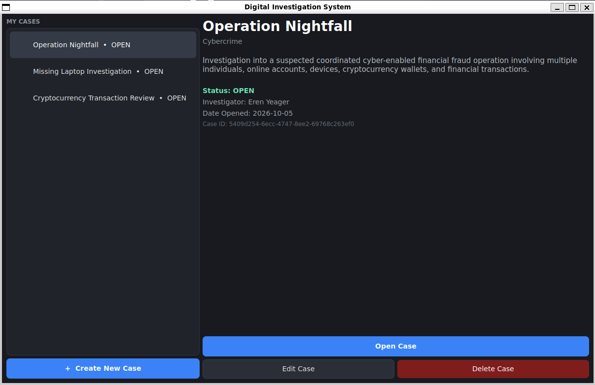
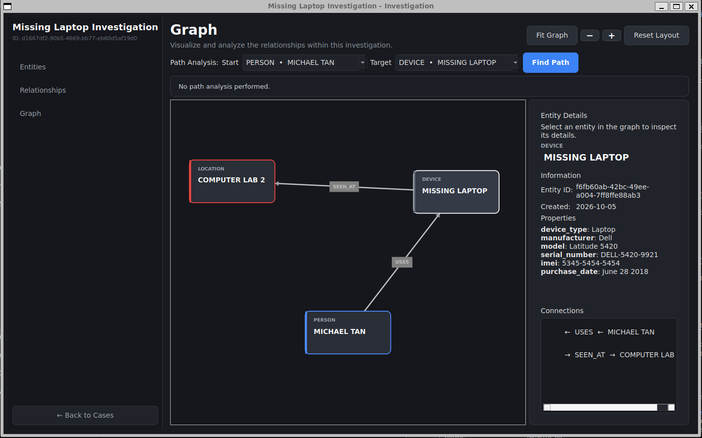
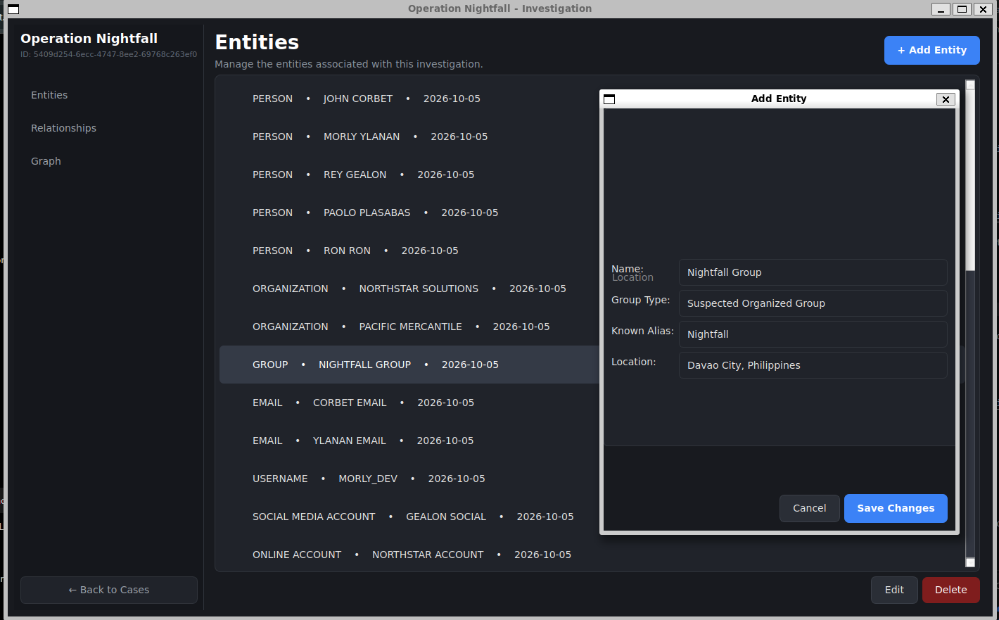
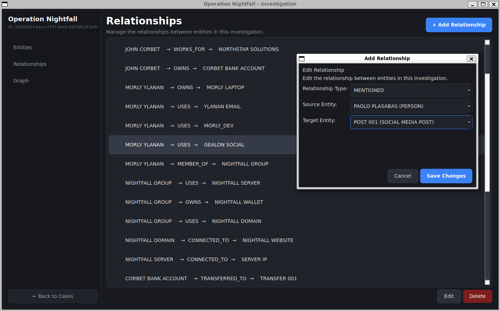
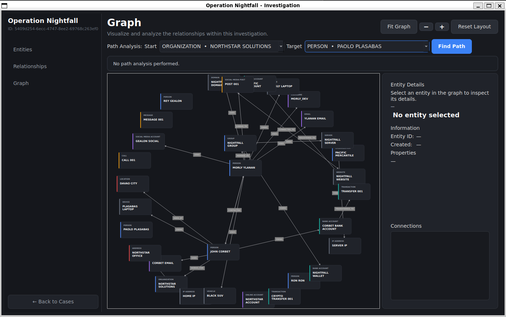
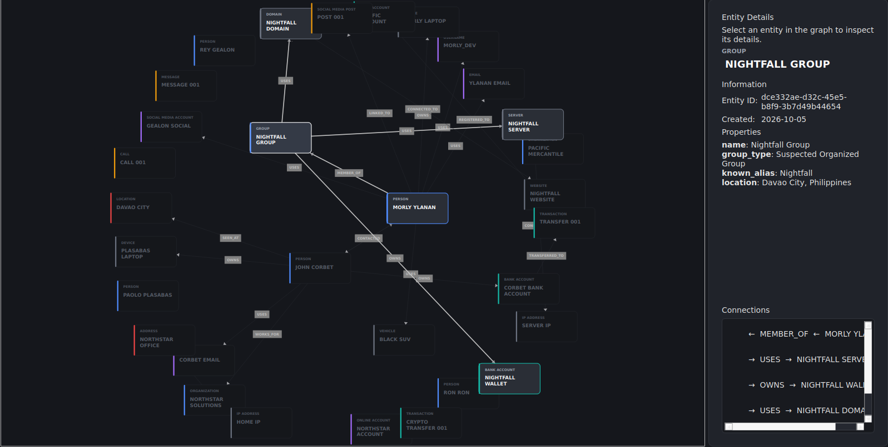
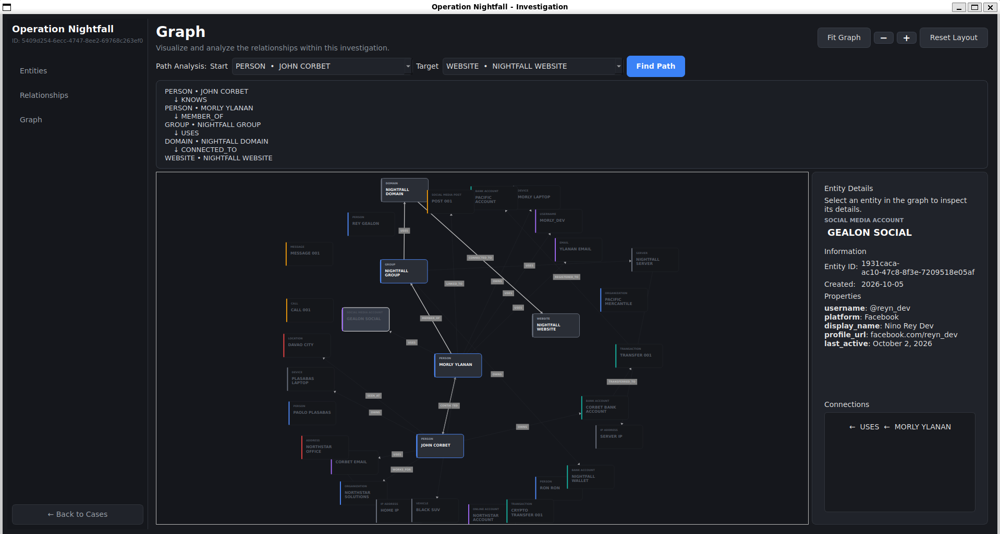

# Digital Investigation and Link Analysis System

## 1. Project Title

### Digital Investigation and Link Analysis System (DIAL)

A desktop-based investigation and link analysis application designed to help users organize entities, relationships, and connections within an investigation case.

---

## 2. Project Description

### Project Overview

The **Digital Investigation and Link Analysis System (DIAL)** is a desktop application developed to assist investigators and analysts in organizing and analyzing information related to an investigation.

The system allows users to create investigation cases and manage different types of entities such as people, organizations, devices, locations, accounts, transactions, and other relevant objects. These entities can be connected through relationships, allowing the system to represent an investigation as a network or graph.

The system also provides graph visualization and link analysis features that allow users to identify connections between entities and find paths between selected entities.

### Problem or Need Addressed

Investigative information can become difficult to manage when there are many entities and relationships involved. Storing information only in separate lists or documents can make it difficult to understand how different entities are connected.

DIAL addresses this problem by providing a centralized system where investigators can:

- Organize investigation cases.
- Store and manage investigation entities.
- Define relationships between entities.
- Visualize connections using a graph.
- Identify connected entities.
- Highlight related entities.
- Find paths between two entities.
- Analyze relationships within an investigation.

---

## 3. Project Objectives

The main objective of the Digital Investigation and Link Analysis System is to provide a structured application for managing and analyzing entities and relationships within an investigation.

### Specific Objectives

1. To provide a system for creating and managing investigation cases.
2. To allow users to create, view, update, and delete investigation entities.
3. To allow users to create, view, update, and delete relationships between entities.
4. To organize investigation information using an object-oriented design.
5. To store investigation data using an SQLite database.
6. To represent entity relationships using a graph structure.
7. To provide an interactive graph visualization of investigation data.
8. To allow users to highlight entities and their direct connections.
9. To provide path analysis between selected source and target entities.
10. To make investigation data easier to understand and analyze.

---

## 4. Features

### Case Management

Users can create and manage investigation cases. Each case provides a separate workspace containing its own entities and relationships.

### Entity Management

Users can create and manage different types of investigation entities.

Examples include:

- Person
- Organization
- Group
- Email
- Phone Number
- Username
- Social Media Account
- Device
- IP Address
- Domain
- Website
- Location
- Address
- Vehicle
- Document
- Bank Account
- Transaction
- Cryptocurrency Wallet
- Event

The system supports:

- Create Entity
- View Entity
- Edit Entity
- Delete Entity

### Relationship Management

Users can establish relationships between entities.

Examples of relationship types include:

- `OWNS`
- `USES`
- `KNOWS`
- `WORKS_FOR`
- `LOCATED_AT`
- `CONNECTED_TO`
- `CONTACTED`
- `MEMBER_OF`
- `REGISTERED_TO`
- `SEEN_AT`

Relationships contain a source entity, target entity, and relationship type.

### Graph Visualization

The system converts investigation entities and relationships into a graph using NetworkX and displays the graph through the PyQt6 graphical interface.

Nodes represent entities while edges represent relationships.

### Entity Selection

Users can select an entity from the graph to inspect its connections and investigation information.

### Connection Highlighting

The system can highlight a selected entity and its direct connections while dimming unrelated entities.

This helps users focus on a specific part of the investigation graph.

### Path Analysis

Users can select a source entity and a target entity and perform a path analysis.

The system searches the investigation graph for a path between the two entities and displays the entities and relationships involved in the path.

### SQLite Data Storage

Investigation cases, entities, and relationships are stored in an SQLite database, allowing data to persist between application sessions.

---

## 5. Technologies Used

### Programming Language

- **Python 3**

### GUI Framework / Library

- **PyQt6**

PyQt6 is used to create the desktop graphical user interface.

### Database

- **SQLite**

SQLite is used for persistent storage of investigation cases, entities, and relationships.

### Other Libraries and Tools

- **NetworkX** – Used to represent and analyze investigation graphs.
- **NumPy** – Required by NetworkX and related graph functionality.
- **Qt Style Sheets (QSS)** – Used to style the application's graphical interface.
- **UUID** – Used to generate unique identifiers for entities and relationships.
- **Python Virtual Environment (`venv`)** – Used to isolate project dependencies.
- **Git** – Used for source code version control.

---

## 6. Project Structure

```text
Digital-investigation-and-Link-Analysis-System/
│
├── main.py
│
├── database/
│   └── database.py
│
├── entities/
│   ├── base/
│   │   └── entity.py
│   │
│   ├── people.py
│   ├── digital_identity.py
│   ├── computing.py
│   ├── communication.py
│   ├── location.py
│   ├── criminal.py
│   └── financial.py
│
├── relations/
│   └── relation.py
│
├── factories/
│   ├── entity_factory.py
│   └── relation_factory.py
│
├── registry/
│   └── entity_registry.py
│
├── graph/
│   ├── investigation_graph.py
│   ├── graph_view.py
│   ├── graph_node.py
│   └── graph_edge.py
│
├── ui/
│   ├── main_window.py
│   ├── investigation_window.py
│   ├── entity_form.py
│   ├── relation_form.py
│   └── styles.qss
│
├── data/
│   └── investigation.db
│
├── .venv/
│
└── README.md
```

### Major Files and Folders

#### `main.py`

The main entry point of the application. It initializes the application and opens the main window.

#### `database/`

Contains the database management functionality.

`database.py` handles operations involving the SQLite database, including:

- Database connection
- Table creation
- Case operations
- Entity operations
- Relationship operations
- Searching and retrieving records

#### `entities/`

Contains the classes representing different types of investigation entities.

The `Entity` class serves as the base class for the entity objects.

#### `relations/`

Contains the relationship model used to represent connections between entities.

#### `factories/`

Contains factory classes used to create entity and relationship objects.

The factory pattern allows objects to be created without requiring the user interface to directly instantiate every specific entity class.

#### `registry/`

Contains the entity registry used by the `EntityFactory` to determine which class should be created for a particular entity type.

#### `graph/`

Contains the graph-related components of the application.

- `investigation_graph.py` – Handles the NetworkX investigation graph.
- `graph_view.py` – Handles graph visualization and interaction.
- `graph_node.py` – Represents graph nodes.
- `graph_edge.py` – Represents graph relationships.

#### `ui/`

Contains the PyQt6 graphical user interface.

- `main_window.py` – Main case management interface.
- `investigation_window.py` – Investigation workspace.
- `entity_form.py` – Entity creation/editing form.
- `relation_form.py` – Relationship creation/editing form.
- `styles.qss` – Application styling.

---

## 7. Installation and Setup

### Requirements

The system requires:

- Python 3
- pip
- Git
- PyQt6
- NetworkX
- NumPy

### 1. Clone the Repository

```bash
git clone <repository-url>
```

Navigate to the project directory:

```bash
cd Digital-investigation-and-Link-Analysis-System
```

### 2. Create a Virtual Environment

```bash
python3 -m venv .venv
```

### 3. Activate the Virtual Environment

On Linux/macOS:

```bash
source .venv/bin/activate
```

On Windows:

```bash
.venv\Scripts\activate
```

### 4. Install Dependencies

```bash
pip install PyQt6 networkx numpy
```

### 5. Run the Application

```bash
python main.py
```

Alternatively, when using the project's virtual environment directly:

```bash
.venv/bin/python main.py
```

### Dependency Installation Summary

```bash
pip install PyQt6 networkx numpy
```

---

## 8. How to Use the System

### Step 1: Launch the Application

Run:

```bash
python main.py
```

The main application window will appear.

### Step 2: Create an Investigation Case

Create a new investigation case by entering the required case information.

After creating the case, select the case and open its investigation workspace.

### Step 3: Add Entities

Open the **Entities** section.

Click **Add Entity** and select the appropriate entity type.

Enter the required entity information and save the entity.

The entity will be stored in the database and associated with the current investigation case.

### Step 4: Manage Entities

From the Entities page, users can:

- View entities
- Select an entity
- Edit an entity
- Delete an entity

### Step 5: Add Relationships

Open the **Relationships** section.

Click **Add Relationship**.

Select:

- Source entity
- Target entity
- Relationship type

Then save the relationship.

### Step 6: Manage Relationships

Users can view, edit, and delete existing relationships.

### Step 7: Open the Graph

Open the **Graph** section.

The system displays the investigation as a graph.

- Nodes represent entities.
- Edges represent relationships.

### Step 8: Explore Entity Connections

Select an entity from the graph to inspect its information and connections.

The system can highlight the selected entity and its directly connected entities.

### Step 9: Perform Path Analysis

Use the **Start** and **Target** entity selectors.

Select the starting entity and target entity, then click **Find Path**.

The system searches the graph for a path between the selected entities.

If a path exists, the path is highlighted in the graph and the path information is displayed in the path analysis panel.

---

## 9. OOP Implementation

The system applies Object-Oriented Programming principles throughout its design.

### Important Classes

#### `Entity`

The base class for investigation entities.

```python
class Entity:
    def __init__(self, type, label):
        self.entity_id = str(uuid.uuid4())
        self.type = type
        self.label = label
        self.date_created = date.today()
        self.properties = {}
```

#### `Person`

Represents a person involved in an investigation.

```python
class Person(Entity):
    ...
```

#### `Organization`

Represents an organization.

```python
class Organization(Entity):
    ...
```

#### `Relation`

Represents a relationship between two entities.

```python
class Relation:
    ...
```

#### `EntityFactory`

Creates entity objects based on the selected entity category and type.

```python
EntityFactory.create(...)
```

#### `RelationFactory`

Creates relationship objects.

```python
RelationFactory.create(...)
```

#### `EntityRegistry`

Stores mappings between entity categories, entity types, and their corresponding classes.

#### `InvestigationGraph`

Responsible for building and analyzing the NetworkX graph.

#### `GraphView`

Responsible for displaying and interacting with the graph in the PyQt6 interface.

#### `GraphNode`

Represents an entity visually in the graph.

#### `GraphEdge`

Represents a relationship visually in the graph.

#### `Database`

Handles communication between the application and the SQLite database.

---

### Encapsulation

Encapsulation is applied by keeping data and operations related to a particular object together.

For example, an `Entity` object contains its own:

- Entity ID
- Type
- Label
- Creation date
- Properties

Database operations are also encapsulated within the `Database` class rather than being directly performed throughout the user interface.

---

### Inheritance

Inheritance is used by specific entity classes inheriting from the base `Entity` class.

For example:

```text
Entity
├── Person
├── Organization
├── Group
├── Location
├── Address
├── Device
└── ...
```

A child class inherits common functionality from `Entity` while adding its own specific properties.

---

### Polymorphism

Polymorphism is applied through the use of different entity classes that share a common base class and interface.

For example, `Person`, `Organization`, `Location`, and `Device` are different types of objects, but they can all be treated as `Entity` objects by the system.

The factory system also allows different entity classes to be created through a common method:

```python
EntityFactory.create(...)
```

---

### Abstraction

The factory and registry system provides abstraction by hiding the details of object creation from the user interface.

Instead of directly creating a specific class:

```python
Person(...)
```

the system can use:

```python
EntityFactory.create(...)
```

This makes object creation more organized and easier to maintain.

---

## 10. Database

The system uses **SQLite** as its relational database.

The database stores information required by the investigation system and allows data to persist after the application is closed.

### Important Tables

#### `cases`

Stores investigation case information.

Example fields include:

```text
case_id
case_name
description
date_created
```

#### `entities`

Stores entities associated with investigation cases.

Example fields include:

```text
entity_id
case_id
entity_type
label
date_created
properties
```

#### `relationships`

Stores connections between entities.

Example fields include:

```text
relation_id
case_id
relation_type
source_id
target_id
```

### Database Relationships

The basic database structure can be represented as:

```text
CASE
 │
 ├── ENTITY
 │    │
 │    └── ENTITY
 │
 └── RELATIONSHIP
       │
       ├── source_id ──> ENTITY
       │
       └── target_id ──> ENTITY
```

A case can contain multiple entities and multiple relationships.

Each relationship connects a source entity to a target entity.

### CRUD Operations

The system performs standard CRUD operations.

#### Create

Used to add:

- Cases
- Entities
- Relationships

#### Read

Used to retrieve:

- Cases
- Entities
- Relationships
- Graph information
- Path analysis information

#### Update

Used to modify existing:

- Cases
- Entities
- Relationships

#### Delete

Used to remove:

- Cases
- Entities
- Relationships

#### Search / Retrieval

The system retrieves entities and relationships based on the current investigation case and selected entity IDs.

Path analysis also retrieves relationships between entities when displaying the resulting path.

---

## 11. Screenshots

The following screenshots should be added to document the major parts of the working application.

### Main Window



The main window displays the available investigation cases and provides controls for creating and opening cases.

### Investigation Workspace



The investigation workspace provides access to entities, relationships, and graph analysis.

### Entity Management



The Entities page allows users to create, view, edit, and delete investigation entities.

### Relationship Management



The Relationships page allows users to create and manage connections between entities.

### Graph Visualization



The graph page visually represents entities as nodes and relationships as edges.

### Entity Highlighting



Selecting an entity highlights the selected entity and its direct connections while dimming unrelated parts of the graph.

### Path Analysis



The path analysis feature allows users to select a source and target entity and find a connection between them.

The resulting path is highlighted in the graph and displayed in the path analysis panel.

---

## 12. Testing

The system was tested by performing different operations through the graphical interface and checking whether the expected results were produced.

### Test Case 1: Create Case

**Action:**

Create a new investigation case.

**Expected Result:**

A new case should be created and displayed in the case list.

**Actual Result:**

The case was successfully created and displayed.

**Status:** Passed

---

### Test Case 2: Create Entity

**Action:**

Create a new entity and enter its required properties.

**Expected Result:**

The entity should be saved and displayed in the entity list.

**Actual Result:**

The entity was successfully saved and displayed.

**Status:** Passed

---

### Test Case 3: Edit Entity

**Action:**

Select an existing entity and modify its information.

**Expected Result:**

The entity should be updated with the new information.

**Actual Result:**

The entity information was successfully updated.

**Status:** Passed

---

### Test Case 4: Delete Entity

**Action:**

Select an entity and delete it.

**Expected Result:**

The entity should be removed from the entity list and database.

**Actual Result:**

The entity was successfully removed.

**Status:** Passed

---

### Test Case 5: Create Relationship

**Action:**

Create a relationship between two existing entities.

**Expected Result:**

The relationship should be stored and displayed in the relationship list.

**Actual Result:**

The relationship was successfully created and displayed.

**Status:** Passed

---

### Test Case 6: Graph Visualization

**Action:**

Open the Graph page after creating entities and relationships.

**Expected Result:**

The entities and relationships should be displayed as nodes and edges.

**Actual Result:**

The investigation graph was successfully displayed.

**Status:** Passed

---

### Test Case 7: Entity Highlighting

**Action:**

Select an entity in the graph.

**Expected Result:**

The selected entity and its direct connections should be highlighted while unrelated entities are dimmed.

**Actual Result:**

The selected entity and its direct connections were successfully highlighted.

**Status:** Passed

---

### Test Case 8: Path Analysis

**Action:**

Select a source entity and target entity and click **Find Path**.

**Expected Result:**

The system should identify a path between the entities if one exists and highlight the path in the graph.

**Actual Result:**

The system successfully identifies and highlights the path when a connection exists.

**Status:** Passed

---

### Test Case 9: No Path Found

**Action:**

Select two entities that do not have a connected path.

**Expected Result:**

The system should inform the user that no path was found.

**Actual Result:**

The system displays a "No connection found" result.

**Status:** Passed

---

## 13. Known Issues / Limitations

The current version of the system has the following limitations:

1. The system is intended for structured investigation and link analysis rather than a complete professional digital forensic investigation platform.

2. The current graph analysis focuses primarily on finding paths between entities.

3. The system currently focuses on the entities and relationships defined within the application's entity catalog.

4. Advanced graph analysis algorithms such as community detection, centrality analysis, clustering, and automatic suspicious-link detection are not yet implemented.

5. The current path analysis primarily identifies a shortest path between the selected source and target entities.

6. Multiple alternative paths are not yet presented as a separate analysis feature.

7. The system currently uses a local SQLite database and does not provide multi-user or remote database functionality.

8. Authentication and role-based access control are not currently implemented.

9. The system is intended as an academic project and may require additional security, validation, and scalability improvements before being used in a production investigation environment.

---

## 14. Author

### Name

**John Michael T. Corbet**

### Section

**CS26L(3581)**

---
